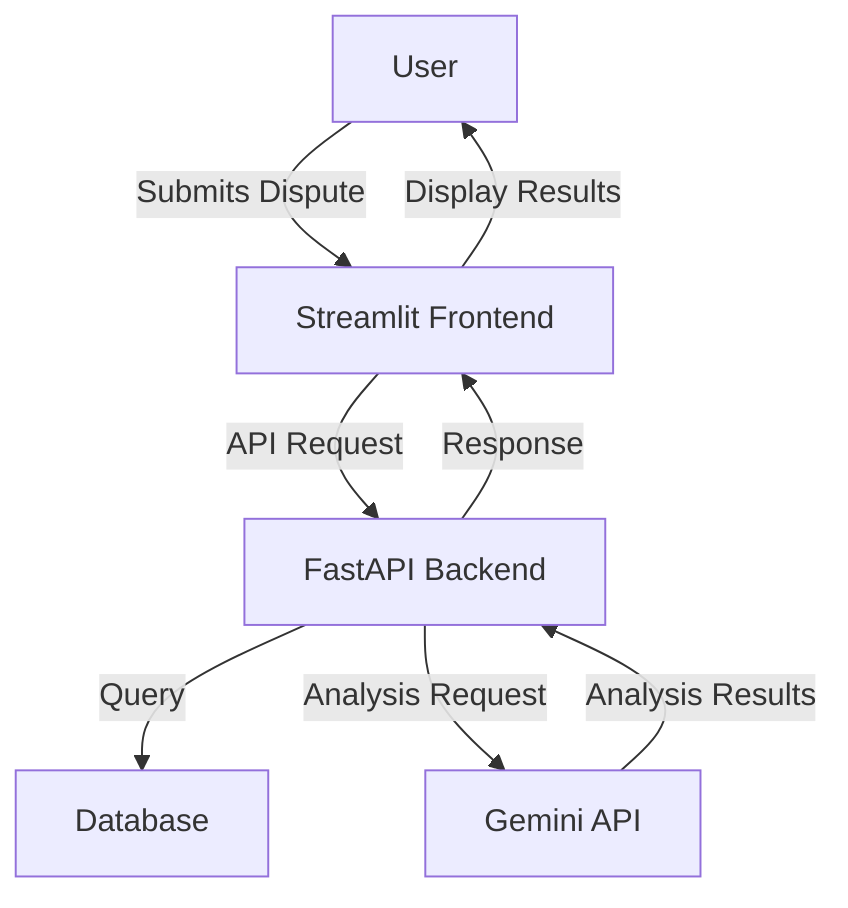
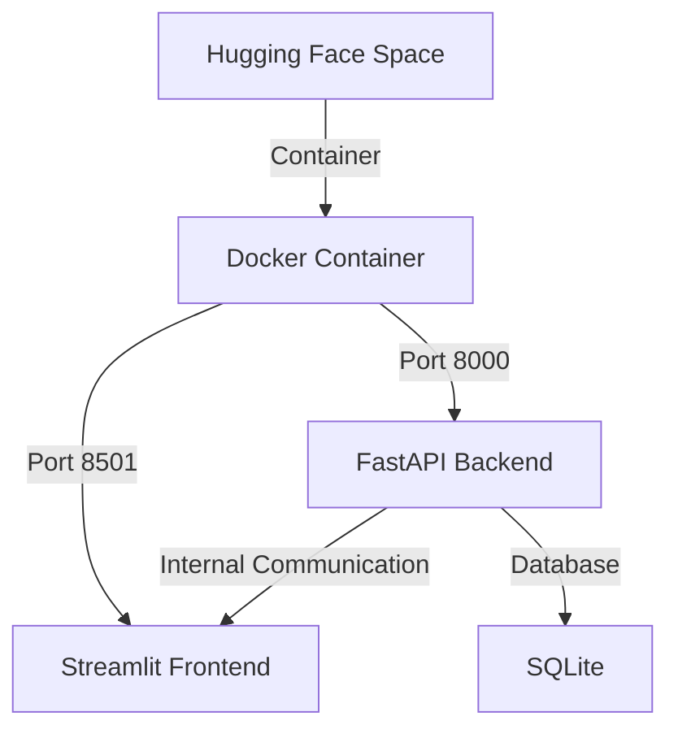
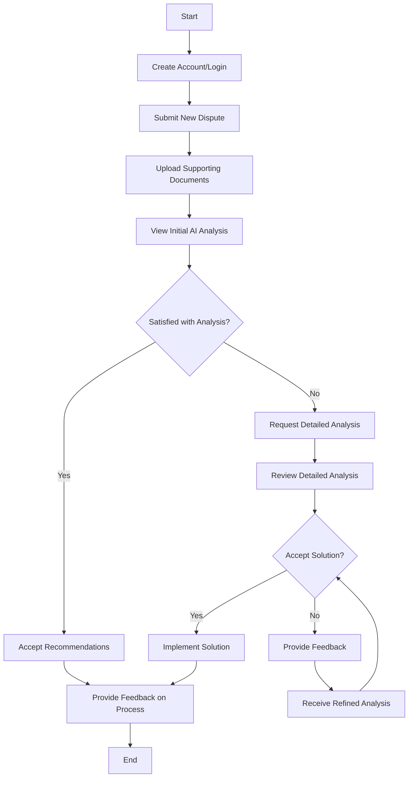

<!-- ---
title: Banking Dispute Resolution System
emoji: 🤖
colorFrom: green
colorTo: gray
pinned: false
sdk: docker
--- -->
# **AI-Powered Financial Dispute Resolution**

[](https://github.com/DebopamParam/AI-Powered_Dispute_Resolution/actions)
[](https://github.com/DebopamParam/AI-Powered_Dispute_Resolution/releases)
[](https://github.com/DebopamParam/AI-Powered_Dispute_Resolution/blob/main/LICENSE)
[](https://www.python.org/)
[](https://fastapi.tiangolo.com/)
[](https://streamlit.io/)
[](https://langchain.com/)
[](https://ai.google.dev/)
[](https://huggingface.co/spaces)

## 📋 Table of Contents
- [Overview](#overview)
- [Key Features](#key-features)
- [Architecture Overview](#architecture-overview)
- [Technologies Used](#technologies-used)
- [Prerequisites](#prerequisites)
- [Installation](#installation)
- [Configuration](#configuration)
- [Usage](#usage)
- [API Documentation](#api-documentation)
- [Testing](#testing)
- [Deployment](#deployment)
- [Contributing](#contributing)
- [License](#license)
- [Acknowledgments](#acknowledgments)
- [Contact/Support](#contactsupport)
- [Disclaimer](#disclaimer)

## 🔍 Overview

The AI-Powered Dispute Resolution system is designed to streamline the process of analyzing and resolving disputes using advanced AI technologies. This application leverages large language models to analyze dispute details, identify key issues, suggest potential solutions, and provide legal references. The system is primarily designed to operate as a standalone application on Hugging Face Spaces, combining a user-friendly Streamlit frontend with a robust FastAPI backend.

## ✨ Key Features

### AI-Powered Analysis
- **Intelligent Dispute Processing**: Analyzes dispute details using Gemini API to extract key information
- **Solution Recommendation**: Suggests potential resolutions based on similar historical cases
- **Legal Reference Integration**: Provides relevant legal references and precedents
- **Continuous Learning**: System improves over time by incorporating feedback from resolved cases

### Frontend Capabilities
- **Intuitive Interface**: User-friendly Streamlit interface for submitting and tracking disputes
- **Dashboard**: Real-time visualization of dispute status and analytics
- **Document Upload**: Support for uploading relevant documents in various formats
- **Explainable AI**: Clear explanations of how the AI reached its conclusions

### Backend Robustness
- **Secure API**: FastAPI backend ensuring secure data processing
- **Efficient Data Management**: Optimized database schema for quick retrieval and analysis
- **Scalable Architecture**: Designed to handle increasing volumes of disputes
- **Comprehensive Logging**: Detailed activity logs for auditing purposes

### Deployment Strategy
- **Hugging Face Integration**: Seamless deployment on Hugging Face Spaces
- **Single Container Solution**: Entire application packaged in a single Docker container
- **Environment Variable Configuration**: Easy configuration through environment variables

## 🏗️ Architecture Overview

### High-Level System Diagram



The diagram above illustrates the flow of data through the system, from user input to AI analysis and result presentation.

### Component Interaction Diagram


This sequence diagram shows the typical flow when a user submits a dispute for analysis.

### Deployment Architecture Diagram



The deployment architecture shows how the application is packaged in a single Docker container for deployment on Hugging Face Spaces.

### Database Schema Diagram


This ER diagram shows the database structure used to store dispute information, analysis results, user data, and feedback.

### User Flow Diagram



This diagram illustrates the typical user journey through the dispute resolution process.

## 🛠️ Technologies Used

- [Python 3.9+](https://www.python.org/) - Programming language
- [FastAPI](https://fastapi.tiangolo.com/) - Backend API framework
- [Streamlit](https://streamlit.io/) - Frontend framework
- [LangChain](https://langchain.com/) - AI integration framework
- [Gemini API](https://ai.google.dev/) - AI language model
- [SQLite](https://www.sqlite.org/) - Database
- [Docker](https://www.docker.com/) - Containerization
- [Hugging Face Spaces](https://huggingface.co/spaces) - Deployment platform

## 📋 Prerequisites

To run this application, you need:

- Python 3.9 or higher
- Docker and Docker Compose
- Gemini API key
- Hugging Face account (for deployment)

## 🔧 Installation

1. Clone the repository:
   ```bash
   git clone https://github.com/DebopamParam/AI-Powered_Dispute_Resolution.git
   cd AI-Powered_Dispute_Resolution
   ```

2. Create a `.env` file in the root directory with the following variables:
   ```
   GEMINI_API_KEY=your_gemini_api_key
   DATABASE_URL=sqlite:///./app.db
   DEBUG=False
   ```

3. Build the Docker image:
   ```bash
   docker build -t dispute-resolution-app .
   ```

## ⚙️ Configuration

### Environment Variables

The application can be configured using the following environment variables:

- `GEMINI_API_KEY` - Your Gemini API key
- `DATABASE_URL` - Database connection string (defaults to SQLite)
- `DEBUG` - Enable debug mode (True/False)
- `LOG_LEVEL` - Logging level (INFO, DEBUG, ERROR)
- `MAX_UPLOAD_SIZE` - Maximum file upload size in MB

### Optional Configuration Files

You can also create the following configuration files:

- `config/app_config.json` - Application-specific settings
- `config/model_config.json` - AI model parameters

## 📝 Usage

### Running Locally

1. Start the application using Docker Compose:
   ```bash
   docker-compose up
   ```

2. Navigate to http://localhost:8501 in your web browser

### Quickstart Guide

1. Create an account or log in
2. Click on "Create New Dispute"
3. Fill in the dispute details:
   - Title
   - Description
   - Parties involved
   - Relevant dates
4. Upload any supporting documents
5. Click "Submit for Analysis"
6. Wait for the AI to analyze the dispute
7. Review the analysis results, which include:
   - Key issues identified
   - Suggested solutions
   - Legal references
8. Provide feedback on the analysis
9. Implement the recommended solutions

## 📚 API Documentation

The API documentation is automatically generated and available at `/docs` when running the application. It provides:

- Complete list of endpoints
- Request and response schemas
- Authentication requirements
- Example requests
- Interactive testing capabilities

## 🧪 Testing

To run the tests:

```bash
# Run all tests
python -m pytest

# Run specific test file
python -m pytest tests/test_api.py

# Run with coverage report
python -m pytest --cov=app tests/
```

## 🚀 Deployment

### Deploying to Hugging Face Spaces

1. Fork this repository
2. Create a new Space on Hugging Face:
   - Type: Docker
   - Repository: Your forked repository
3. Add the following secrets to your Space:
   - `GEMINI_API_KEY` - Your Gemini API key
4. The Space will automatically build and deploy the application

### Deploying Locally with Docker Compose

1. Make sure Docker and Docker Compose are installed
2. Create the `.env` file as described in the Installation section
3. Run the following command:
   ```bash
   docker-compose up -d
   ```
4. Access the application at http://localhost:8501

## 🤝 Contributing

Contributions are welcome! Please follow these steps:

1. Fork the repository
2. Create a new branch (`git checkout -b feature/amazing-feature`)
3. Make your changes
4. Commit your changes (`git commit -m 'Add some amazing feature'`)
5. Push to the branch (`git push origin feature/amazing-feature`)
6. Open a Pull Request

Please make sure your code follows the project's coding standards and includes appropriate tests.

## 📄 License

This project is licensed under the MIT License - see the [LICENSE](https://github.com/DebopamParam/AI-Powered_Dispute_Resolution/blob/main/LICENSE) file for details.

## 👏 Acknowledgments

- [FastAPI](https://fastapi.tiangolo.com/) for the efficient API framework
- [Streamlit](https://streamlit.io/) for the intuitive frontend framework
- [LangChain](https://langchain.com/) for simplifying AI integration
- [Gemini API](https://ai.google.dev/) for the powerful language model
- [Hugging Face Spaces](https://huggingface.co/spaces) for the deployment platform

## 📞 Contact/Support

- For bug reports and feature requests, please [open an issue](https://github.com/DebopamParam/AI-Powered_Dispute_Resolution/issues)

## ⚠️ Disclaimer

This project is a prototype and should be used with caution. The AI-generated recommendations should not be considered legal advice. Always consult with a qualified legal professional for legal matters.


# API Endpoints with JSON Structures

## Customers Endpoints

### 1. Create Customer

-   **Endpoint**: `/customers/`
-   **Method**: POST
-   **Operation**: Create
-   **Input JSON**:
    
    ```json
    {  "name": "John Doe",  "email": "john.doe@example.com",  "account_type": "Individual"}
    
    ```
    
-   **Output JSON**:
    
    ```json
    {  "id": "550e8400-e29b-41d4-a716-446655440000",  "name": "John Doe",  "email": "john.doe@example.com",  "account_type": "Individual",  "dispute_count": 0,  "created_at": "2025-03-22T14:30:45.123456"}
    
    ```
    
-   **Status Code**: 201

### 2. Get All Customers

-   **Endpoint**: `/customers/`
-   **Method**: GET
-   **Operation**: Read
-   **Query Parameters**:
    -   `skip`: int (default: 0)
    -   `limit`: int (default: 100)
    -   `account_type`: string (optional)
-   **Output JSON**:
    
    ```json
    [  {    "id": "550e8400-e29b-41d4-a716-446655440000",    "name": "John Doe",    "email": "john.doe@example.com",    "account_type": "Individual",    "dispute_count": 2,    "created_at": "2025-03-22T14:30:45.123456"  },  {    "id": "550e8400-e29b-41d4-a716-446655440001",    "name": "Jane Smith",    "email": "jane.smith@example.com",    "account_type": "Business",    "dispute_count": 0,    "created_at": "2025-03-21T10:15:30.654321"  }]
    
    ```
    
-   **Status Code**: 200

### 3. Get Customer by ID

-   **Endpoint**: `/customers/{customer_id}`
-   **Method**: GET
-   **Operation**: Read
-   **Path Parameter**:
    -   `customer_id`: string
-   **Output JSON**:
    
    ```json
    {  "id": "550e8400-e29b-41d4-a716-446655440000",  "name": "John Doe",  "email": "john.doe@example.com",  "account_type": "Individual",  "dispute_count": 2,  "created_at": "2025-03-22T14:30:45.123456"}
    
    ```
    
-   **Status Code**: 200

### 4. Get Customer's Disputes

-   **Endpoint**: `/customers/{customer_id}/disputes`
-   **Method**: GET
-   **Operation**: Read
-   **Path Parameter**:
    -   `customer_id`: string
-   **Query Parameters**:
    -   `skip`: int (default: 0)
    -   `limit`: int (default: 100)
-   **Output JSON**:
    
    ```json
    [  {    "id": "550e8400-e29b-41d4-a716-446655440010",    "customer_id": "550e8400-e29b-41d4-a716-446655440000",    "transaction_id": "T12345",    "merchant_name": "Example Store",    "amount": 99.99,    "description": "Unauthorized charge",    "category": "Unauthorized",    "status": "Open",    "priority": 3,    "created_at": "2025-03-22T15:30:45.123456",    "resolved_at": null  }]
    
    ```
    
-   **Status Code**: 200

### 5. Update Customer

-   **Endpoint**: `/customers/{customer_id}`
-   **Method**: PUT
-   **Operation**: Update
-   **Path Parameter**:
    -   `customer_id`: string
-   **Input JSON**:
    
    ```json
    {  "name": "John Doe Updated",  "email": "john.updated@example.com",  "account_type": "Business"}
    
    ```
    
-   **Output JSON**:
    
    ```json
    {  "id": "550e8400-e29b-41d4-a716-446655440000",  "name": "John Doe Updated",  "email": "john.updated@example.com",  "account_type": "Business",  "dispute_count": 2,  "created_at": "2025-03-22T14:30:45.123456"}
    
    ```
    
-   **Status Code**: 200

### 6. Delete Customer

-   **Endpoint**: `/customers/{customer_id}`
-   **Method**: DELETE
-   **Operation**: Delete
-   **Path Parameter**:
    -   `customer_id`: string
-   **Output JSON**:
    
    ```json
    {  "message": "Customer deleted successfully"}
    
    ```
    
-   **Status Code**: 200

## Disputes Endpoints

### 1. Create Dispute

-   **Endpoint**: `/disputes/`
-   **Method**: POST
-   **Operation**: Create
-   **Input JSON**:
    
    ```json
    {  "customer_id": "550e8400-e29b-41d4-a716-446655440000",  "transaction_id": "T12345",  "merchant_name": "Example Store",  "amount": 99.99,  "description": "Unauthorized charge",  "category": "Unauthorized"}
    
    ```
    
-   **Output JSON**:
    
    ```json
    {  "id": "550e8400-e29b-41d4-a716-446655440010",  "customer_id": "550e8400-e29b-41d4-a716-446655440000",  "transaction_id": "T12345",  "merchant_name": "Example Store",  "amount": 99.99,  "description": "Unauthorized charge",  "category": "Unauthorized",  "status": "Open",  "priority": null,  "created_at": "2025-03-22T15:30:45.123456",  "resolved_at": null}
    
    ```
    
-   **Status Code**: 201

### 2. Get All Disputes

-   **Endpoint**: `/disputes/`
-   **Method**: GET
-   **Operation**: Read
-   **Query Parameters**:
    -   `skip`: int (default: 0)
    -   `limit`: int (default: 100)
    -   `status`: string (optional)
    -   `priority_sort`: bool (default: true)
-   **Output JSON**:
    
    ```json
    [  {    "id": "550e8400-e29b-41d4-a716-446655440010",    "customer_id": "550e8400-e29b-41d4-a716-446655440000",    "transaction_id": "T12345",    "merchant_name": "Example Store",    "amount": 99.99,    "description": "Unauthorized charge",    "category": "Unauthorized",    "status": "Open",    "priority": 3,    "created_at": "2025-03-22T15:30:45.123456",    "resolved_at": null  }]
    
    ```
    
-   **Status Code**: 200

### 3. Get Dispute by ID

-   **Endpoint**: `/disputes/{dispute_id}`
-   **Method**: GET
-   **Operation**: Read
-   **Path Parameter**:
    -   `dispute_id`: string
-   **Output JSON**:
    
    ```json
    {  "id": "550e8400-e29b-41d4-a716-446655440010",  "customer_id": "550e8400-e29b-41d4-a716-446655440000",  "transaction_id": "T12345",  "merchant_name": "Example Store",  "amount": 99.99,  "description": "Unauthorized charge",  "category": "Unauthorized",  "status": "Open",  "priority": 3,  "created_at": "2025-03-22T15:30:45.123456",  "resolved_at": null,  "customer": {    "id": "550e8400-e29b-41d4-a716-446655440000",    "name": "John Doe",    "email": "john.doe@example.com",    "account_type": "Individual",    "dispute_count": 2,    "created_at": "2025-03-22T14:30:45.123456"  }}
    
    ```
    
-   **Status Code**: 200

### 4. Update Dispute

-   **Endpoint**: `/disputes/{dispute_id}`
-   **Method**: PUT
-   **Operation**: Update
-   **Path Parameter**:
    -   `dispute_id`: string
-   **Input JSON**:
    
    ```json
    {  "status": "Under Review",  "priority": 4,  "description": "Updated description of the dispute"}
    
    ```
    
-   **Output JSON**:
    
    ```json
    {  "id": "550e8400-e29b-41d4-a716-446655440010",  "customer_id": "550e8400-e29b-41d4-a716-446655440000",  "transaction_id": "T12345",  "merchant_name": "Example Store",  "amount": 99.99,  "description": "Updated description of the dispute",  "category": "Unauthorized",  "status": "Under Review",  "priority": 4,  "created_at": "2025-03-22T15:30:45.123456",  "resolved_at": null}
    
    ```
    
-   **Status Code**: 200

### 5. Delete Dispute

-   **Endpoint**: `/disputes/{dispute_id}`
-   **Method**: DELETE
-   **Operation**: Delete
-   **Path Parameter**:
    -   `dispute_id`: string
-   **Output JSON**:
    
    ```json
    {  "message": "Dispute deleted successfully"}
    
    ```
    
-   **Status Code**: 200

### 6. Analyze Dispute

-   **Endpoint**: `/disputes/{dispute_id}/analyze`
-   **Method**: POST
-   **Operation**: Create (Analysis)
-   **Path Parameter**:
    -   `dispute_id`: string
-   **Output JSON**:
    
    ```json
    {  "dispute_id": "550e8400-e29b-41d4-a716-446655440010",  "analysis": {    "priority": 4,    "priority_reason": "High value transaction with a new merchant",    "insights": "This appears to be a legitimate dispute based on transaction history.",    "followup_questions": ["When did you first notice the charge?", "Have you contacted the merchant?"],    "probable_solutions": ["Issue chargeback to merchant", "Request more information from customer"],    "possible_reasons": ["Fraudulent merchant", "Unauthorized use of card"],    "risk_score": 7.5,    "risk_factors": ["High transaction amount", "First transaction with merchant"]  }}
    
    ```
    
-   **Status Code**: 201

### 7. Create Dispute Insights

-   **Endpoint**: `/disputes/{dispute_id}/insights`
-   **Method**: POST
-   **Operation**: Create
-   **Path Parameter**:
    -   `dispute_id`: string
-   **Input JSON**:
    
    ```json
    {  "insights": "Detailed analysis of the dispute situation",  "followup_questions": ["Question 1?", "Question 2?"],  "probable_solutions": ["Solution 1", "Solution 2"],  "possible_reasons": ["Reason 1", "Reason 2"],  "risk_score": 6.5,  "risk_factors": ["Factor 1", "Factor 2"],  "priority_level": 4,  "priority_reason": "Explanation for the priority level"}
    
    ```
    
-   **Output JSON**:
    
    ```json
    {  "id": "550e8400-e29b-41d4-a716-446655440020",  "dispute_id": "550e8400-e29b-41d4-a716-446655440010",  "insights": "Detailed analysis of the dispute situation",  "followup_questions": ["Question 1?", "Question 2?"],  "probable_solutions": ["Solution 1", "Solution 2"],  "possible_reasons": ["Reason 1", "Reason 2"],  "risk_score": 6.5,  "risk_factors": ["Factor 1", "Factor 2"],  "priority_level": 4,  "priority_reason": "Explanation for the priority level",  "created_at": "2025-03-22T16:30:45.123456",  "updated_at": null}
    
    ```
    
-   **Status Code**: 201

### 8. Get Dispute Insights

-   **Endpoint**: `/disputes/{dispute_id}/insights`
-   **Method**: GET
-   **Operation**: Read
-   **Path Parameter**:
    -   `dispute_id`: string
-   **Output JSON**:
    
    ```json
    {  "id": "550e8400-e29b-41d4-a716-446655440020",  "dispute_id": "550e8400-e29b-41d4-a716-446655440010",  "insights": "Detailed analysis of the dispute situation",  "followup_questions": ["Question 1?", "Question 2?"],  "probable_solutions": ["Solution 1", "Solution 2"],  "possible_reasons": ["Reason 1", "Reason 2"],  "risk_score": 6.5,  "risk_factors": ["Factor 1", "Factor 2"],  "priority_level": 4,  "priority_reason": "Explanation for the priority level",  "created_at": "2025-03-22T16:30:45.123456",  "updated_at": null}
    
    ```
    
-   **Status Code**: 200

### 9. Update Dispute Insights

-   **Endpoint**: `/disputes/{dispute_id}/insights`
-   **Method**: PUT
-   **Operation**: Update
-   **Path Parameter**:
    -   `dispute_id`: string
-   **Input JSON**:
    
    ```json
    {  "insights": "Updated analysis of the dispute situation",  "followup_questions": ["Updated question 1?", "Updated question 2?"],  "probable_solutions": ["Updated solution 1", "Updated solution 2"],  "possible_reasons": ["Updated reason 1", "Updated reason 2"],  "risk_score": 8.0,  "risk_factors": ["Updated factor 1", "Updated factor 2"],  "priority_level": 5,  "priority_reason": "Updated explanation for the priority level"}
    
    ```
    
-   **Output JSON**:
    
    ```json
    {  "id": "550e8400-e29b-41d4-a716-446655440020",  "dispute_id": "550e8400-e29b-41d4-a716-446655440010",  "insights": "Updated analysis of the dispute situation",  "followup_questions": ["Updated question 1?", "Updated question 2?"],  "probable_solutions": ["Updated solution 1", "Updated solution 2"],  "possible_reasons": ["Updated reason 1", "Updated reason 2"],  "risk_score": 8.0,  "risk_factors": ["Updated factor 1", "Updated factor 2"],  "priority_level": 5,  "priority_reason": "Updated explanation for the priority level",  "created_at": "2025-03-22T16:30:45.123456",  "updated_at": "2025-03-22T17:45:30.987654"}
    
    ```
    
-   **Status Code**: 200